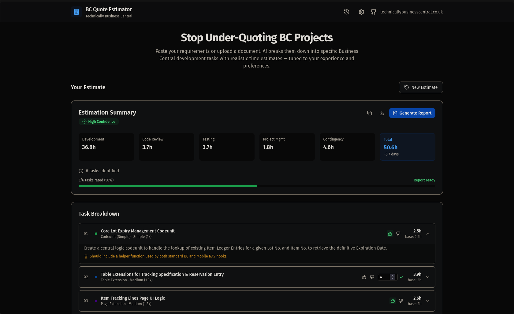

# BC Quote Estimator

AI-powered project estimation tool for Business Central / AL development. Paste your requirements or upload a document, and get a detailed breakdown of development tasks with realistic time estimates — tuned to your experience and preferences.

Built with Next.js, Tailwind CSS, and the Vercel AI SDK. Supports Anthropic (Claude) and Google (Gemini) as AI providers.

## Screenshots




## Features

- **AI-driven task breakdown** — Parses free-text requirements into specific BC development tasks (tables, pages, codeunits, reports, integrations, etc.)
- **Configurable estimation settings** — Adjust estimation style (lean/realistic/padded), developer experience level, task granularity, complexity multipliers, overhead percentages, and hourly rate
- **Document upload** — Supports PDF and DOCX file uploads for requirement extraction
- **Quote history** — Saves estimates to a Postgres database, grouped by browser session
- **Task & quote ratings** — Rate individual tasks (thumbs up/down) and record actual hours spent
- **Analytics-driven tuning** — Suggests multiplier adjustments based on historical accuracy with recency-weighted analysis
- **Multiple AI providers** — Choose between Anthropic and Google, with dynamic model listing from provider APIs

## Getting Started

### Prerequisites

- Node.js 18+
- A [Neon](https://neon.tech) Postgres database (or any Postgres-compatible connection string)
- An API key from [Anthropic](https://console.anthropic.com/) or [Google AI Studio](https://aistudio.google.com/)

### Installation

```bash
git clone https://github.com/bfrymire/bc-quote-estimator.git
cd bc-quote-estimator
npm install
```

### Environment Variables

Copy the example env file and fill in your values:

```bash
cp .env.example .env
```

| Variable | Required | Description |
|----------|----------|-------------|
| `DATABASE_URL` | Yes | Neon Postgres connection string |
| `ANTHROPIC_API_KEY` | No | Default Anthropic API key (users can also enter their own in the UI) |
| `GOOGLE_AI_API_KEY` | No | Default Google AI API key |
| `AI_PROVIDER` | No | Default provider — `anthropic` or `google` |

### Database Setup

Push the Drizzle schema to your database:

```bash
npm run db:push
```

To inspect the database with Drizzle Studio:

```bash
npm run db:studio
```

### Running

```bash
npm run dev
```

Open [http://localhost:3000](http://localhost:3000).

## Tech Stack

- **Framework** — [Next.js](https://nextjs.org/) (App Router, Turbopack)
- **Styling** — [Tailwind CSS](https://tailwindcss.com/) v4
- **AI** — [Vercel AI SDK](https://sdk.vercel.ai/) with Anthropic and Google providers
- **Database** — PostgreSQL via [Neon](https://neon.tech) serverless driver + [Drizzle ORM](https://orm.drizzle.team/)
- **Document parsing** — [pdf-parse](https://www.npmjs.com/package/pdf-parse), [mammoth](https://www.npmjs.com/package/mammoth)
- **UI** — [Lucide](https://lucide.dev/) icons, [Framer Motion](https://www.framer.com/motion/), [Sonner](https://sonner.emilkowal.dev/) toasts, [react-dropzone](https://react-dropzone.js.org/)

## Project Structure

```
src/
├── app/
│   ├── api/
│   │   ├── analytics/     # Multiplier suggestion endpoint
│   │   ├── estimate/      # Core AI estimation endpoint
│   │   ├── models/        # Dynamic model listing
│   │   ├── parse-pdf/     # PDF/DOCX text extraction
│   │   └── quotes/        # Quote CRUD & ratings
│   ├── history/           # Quote history page
│   ├── layout.tsx
│   └── page.tsx           # Main estimation form
├── components/
│   ├── api-key-input.tsx       # Provider & API key selector
│   ├── estimation-results.tsx  # Task breakdown display
│   ├── header.tsx
│   ├── quote-history.tsx       # Saved quotes list
│   ├── quote-rating.tsx        # Overall quote feedback
│   ├── requirements-input.tsx  # Text input & file upload
│   ├── settings-modal.tsx      # Estimation tuning controls
│   └── task-rating.tsx         # Per-task rating UI
└── lib/
    ├── ai-prompt.ts       # System & user prompt builders
    ├── analytics.ts       # Recency-weighted multiplier suggestions
    ├── db/
    │   ├── index.ts       # Neon connection
    │   ├── queries.ts     # Database operations
    │   └── schema.ts      # Drizzle table definitions
    ├── estimation-rules.ts # Base hours, categories, multipliers
    ├── session.ts         # Browser session ID management
    └── types.ts           # Shared TypeScript types
```

## License

[MIT](LICENSE)
